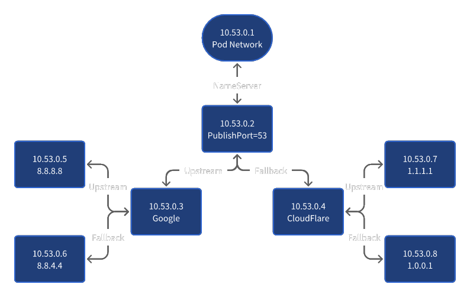

# DNS Proxy

Quadlet files for DNS Proxy.

## Description

- If you are in China, use `./Quadlets/China` as `/`.
- If you are not in China, use `./Quadlets/Global` as `/`.

## Usage

China:

```shell
systemctl daemon-reload
systemctl start dnsproxy-upstream-main.service
systemctl start dnsproxy-upstream-fallback.service
systemctl start dnsproxy.service
```

Global:

```shell
systemctl daemon-reload
systemctl start dnsproxy-upstream-main-google.service
systemctl start dnsproxy-upstream-main-cloudflare.service
systemctl start dnsproxy-upstream-main.service
systemctl start dnsproxy-upstream-fallback-google.service
systemctl start dnsproxy-upstream-fallback-cloudflare.service
systemctl start dnsproxy-upstream-fallback.service
systemctl start dnsproxy.service
```

Of course, if you want to start network manually instead of called by containers, you can run:

```shell
systemctl daemon-reload
systemctl start dnsproxy-network.service
```

Please notice that these services cannot be enabled, because they are generated by `/usr/lib/systemd/system-generators/podman-system-generator`.

It is already autostarted on boot, due to we added `[Install]` section in the container files.

## Architecture

The `Global`'s architecture is:



## Notice
This Pod can only allow dns queries from `127.0.0.1`.

Due to `SystemD-Resolved` already listening on `127.0.0.53:53`,
we didn't use `0.0.0.0` to publish the ports.

### Intranet Sharing

If you want to share it to intranet,
you should add overrides to main container file `dnsproxy.container` via `dnsproxy.container.d/00-intranet.conf`:

```systemd-unit
[Container]
PublishPorts={IntranetIPAddress}:53:53/tcp
PublishPorts={IntranetIPAddress}:53:53/udp
```

### Internet Sharing

It is not recommended due to we won't implement things such as `DoH` or `DoT`,
bacause it is hard to have a good cross-country network environment due to Gonvernment's policy.

Such as `GFW` in China.

If you want to share it to intranet,
you should add overrides to main container file `dnsproxy.container` via `dnsproxy.container.d/01-intranet.conf`:

```systemd-unit
[Container]
PublishPorts={InternetIPAddress}:53:53/tcp
PublishPorts={InternetIPAddress}:53:53/udp
```


# License

- [AGPL-3.0-only](https://www.gnu.org/licenses/agpl-3.0.html)

# Thanks to

- [AdguardTeam/dnsproxy](https://github.com/AdguardTeam/dnsproxy)
- [containers/podman](https://github.com/containers/podman)
